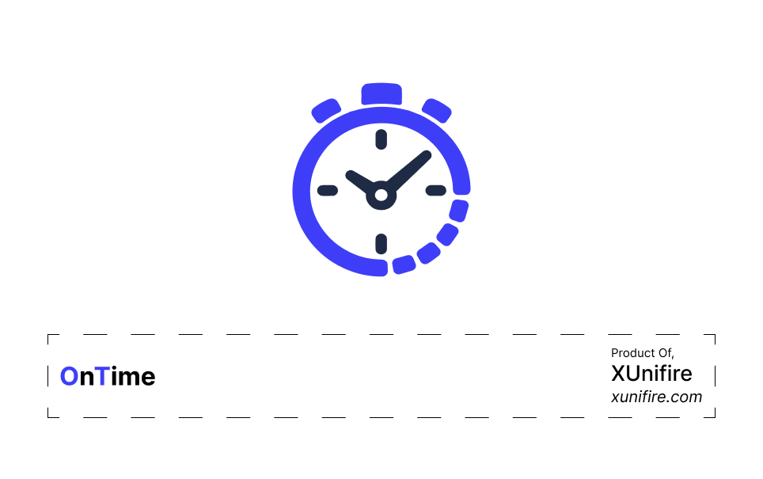
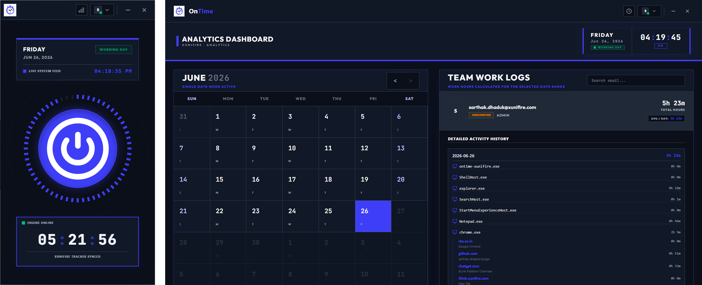

  
  &nbsp;&nbsp;
  
  &nbsp;&nbsp;
  

<!-- PROJECT LOGO & HEADER -->
 
 

  

 
 

    <strong>An Employee Productivity and Work Activity Monitoring Application</strong>
     
    Developed and maintained by XUnifire exclusively for its workforce.
     
     
    
    &nbsp;&nbsp;
    
    &nbsp;&nbsp;
    

 

<!-- TABLE OF CONTENTS / NAVIGATION AT TOP -->
<h3 align="center"></h3>

  <a href="#-overview">Overview</a> •
  <a href="#-about-ontime">About OnTime</a> •
  <a href="#-use-of-ontime">Use of OnTime</a> •
  <a href="#-problems-solved-by-ontime">Problems Solved</a> •
  <a href="#-features">Features</a> •
  <a href="#-how-the-platform-works">How It Works</a> •
  <a href="#-contact">Contact</a>

### 

OnTime is an employee productivity and work activity monitoring application developed and maintained by **XUnifire** exclusively for its workforce. The software is designed to help the organization maintain accurate working hour records, improve productivity, and ensure transparency during official working hours through secure and automated activity tracking.

  

OnTime operates silently in the background of an employee's computer, monitoring work-related activity only while it is active. It records application usage, browsing activity, active working time, and productivity metrics while providing automatic synchronization, offline support, and intelligent idle detection for accurate attendance and work-hour calculation.

### 

OnTime is an internal productivity monitoring solution built specifically for employees of XUnifire. Unlike traditional attendance software, OnTime focuses on measuring actual active working time rather than simply recording login and logout times. It automatically detects user activity and accurately records productive work based on keyboard and mouse interactions.

  

The application is designed to be lightweight, secure, and reliable. It continues running in the background after startup, automatically tracking work activity throughout office hours. Even without an internet connection, OnTime continues recording activity locally and synchronizes all collected data with the server once connectivity is restored.

### Key Highlights

* Exclusively available for XUnifire employees
* Secure employee authentication
* Background activity monitoring
* Automatic work-hour calculation
* Intelligent idle detection
* Offline data collection with automatic synchronization
* Application usage tracking
* Website browsing activity tracking
* Automatic reminders during working hours
* Accurate productivity measurement

### 

### Why Use OnTime?

Modern workplaces require accurate tracking of productive work instead of simply measuring office presence. Employees often switch between applications, websites, meetings, and different work environments. Manual attendance systems cannot accurately reflect actual working activity.

OnTime solves this challenge by automatically recording productive work based on real employee interaction with the computer. It ensures transparency, accurate work-hour calculations, and reliable productivity reporting while reducing manual attendance management.

---

### Getting Started

#### Account Setup

1. Download and install OnTime on your Windows PC or laptop.
2. Launch the application.
3. Click **Login**.
4. Select **Add Account** if you are a new employee.
5. Enter your official **@xunifire.com** email address.
6. Verify your account using your password and OTP.
7. Complete account registration.
8. Login using your verified credentials.

---

#### Daily Usage

1. Start OnTime before beginning your workday.
2. Once started, the application continues running in the background.
3. Continue your normal work without keeping the application window open.
4. OnTime automatically tracks work activity during official office hours.
5. If you are on leave, simply change your work status to **On Leave** to stop reminder notifications.

---

#### Smart Reminder System

If your work status is marked as **On Work** during official working hours (8:00 AM to 7:00 PM) but OnTime is not running, the application sends reminder notifications every **10 minutes** encouraging you to start the software.

When your status is updated to **On Leave**, reminder notifications are automatically disabled.

---

#### Employee Notice

While OnTime is running during official working hours, the software records your computer activity, including application usage, browsing activity, keyboard interaction, and mouse activity for work-hour calculation purposes.

Employees should avoid performing personal activities on the monitored system during official working hours while OnTime is active.

### 

* Eliminates manual attendance tracking
* Measures actual productive work instead of login duration
* Tracks application usage automatically
* Records website browsing activity
* Prevents inaccurate work-hour reporting
* Automatically detects idle time
* Supports offline work environments
* Synchronizes records automatically after internet restoration
* Reduces manual HR attendance verification
* Provides reliable employee productivity insights

### 

### Employee Authentication

- [x] Secure employee login
- [x] Official **@xunifire.com** account verification
- [x] OTP verification
- [x] Password-protected authentication

### Background Monitoring

- [x] Runs silently in the background
- [x] No need to keep the application window open
- [x] Automatic startup monitoring
- [x] Lightweight resource usage

### Activity Tracking

- [x] Keyboard activity monitoring
- [x] Mouse activity monitoring
- [x] Active working hour calculation
- [x] Application usage tracking
- [x] Website browsing history tracking

### Productivity Monitoring

- [x] Active work duration
- [x] Productivity calculation
- [x] Work session recording
- [x] Accurate working-hour reports

### Smart Reminder System

- [x] Reminder every 10 minutes if OnTime is not running
- [x] Active only during office hours
- [x] Automatically disabled when employee status is **On Leave**

### Intelligent Idle Detection

- [x] Stops tracking after 10 minutes without keyboard or mouse movement
- [x] Removes the previous 10 minutes from recorded work time
- [x] Stops tracking if only mouse movement occurs without keyboard activity and no mouse clicks for 15 minutes
- [x] Removes the previous 15 minutes from work records for inactive sessions

### Offline Support

- [x] Fully functional without internet
- [x] Local encrypted data storage
- [x] Automatic synchronization when internet becomes available

### Data Synchronization

- [x] Automatic background syncing
- [x] Secure server communication
- [x] Reliable offline-to-online synchronization

### 

OnTime is designed to provide accurate work-hour tracking through intelligent activity monitoring while minimizing manual interaction.

### Authentication Workflow

1. Employee installs the software.
2. Employee registers using an official **@xunifire.com** email address.
3. Account verification is completed using password and OTP.
4. Employee logs into OnTime.

---

### Daily Monitoring Workflow

1. Employee starts OnTime.
2. The application moves to the background.
3. During official working hours (8:00 AM – 7:00 PM), activity monitoring begins automatically.
4. The application continuously records:
   * Active applications
   * Website browsing activity
   * Keyboard usage
   * Mouse movement
   * Mouse clicks
   * Active working duration
5. Activity records are securely stored until synchronized with the server.

---

### Idle Detection Workflow

To ensure accurate work-hour calculation, OnTime automatically detects inactivity.

#### Rule 1
If there is **no keyboard or mouse movement for 10 consecutive minutes**:
* Activity tracking stops automatically.
* The previous 10 minutes are removed from the recorded work session.

#### Rule 2
If there is **mouse movement only**, with:
* No keyboard input
* No mouse clicks
* For 15 consecutive minutes

Then:
* Tracking stops automatically.
* The previous 15 minutes are removed from work records.

---

### Offline Synchronization Workflow

1. If internet connectivity is unavailable, OnTime continues recording work activity locally.
2. All activity data remains securely stored on the employee's device.
3. Once internet access is restored, the software automatically synchronizes all pending records with the central server.
4. No manual synchronization is required.

---

### Reminder Workflow

1. During office hours, the system checks whether OnTime is running.
2. If the employee status is **On Work** and the application is closed:
   * Reminder notifications are sent every 10 minutes.
3. If employee status changes to **On Leave**:
   * Reminder notifications stop automatically.

### 

For technical support, employee account assistance, or software-related inquiries, please contact:

**Email:** [support@xunifire.com](mailto:support@xunifire.com)

OnTime is an internal software solution exclusively developed, maintained, and owned by **XUnifire** for authorized employees. All rights reserved.

<!-- MARKDOWN LINKS & IMAGES REFERENCE -->

[stars-shield]: https://img.shields.io/github/stars/XUnifire/OnTime.svg?style=for-the-badge
[stars-url]: https://github.com/XUnifire/OnTime/stargazers
[issues-shield]: https://img.shields.io/github/issues/XUnifire/OnTime.svg?style=for-the-badge
[issues-url]: https://github.com/XUnifire/OnTime/issues
[linkedin-shield]: https://img.shields.io/badge/-LinkedIn-black.svg?style=for-the-badge&logo=linkedin&colorB=555
[linkedin-url]: https://www.linkedin.com/company/xunifire/
